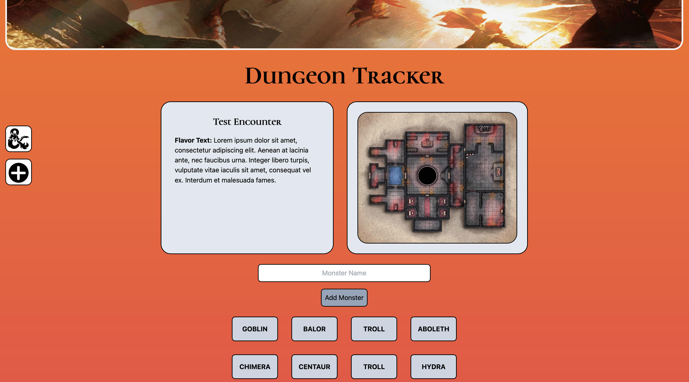
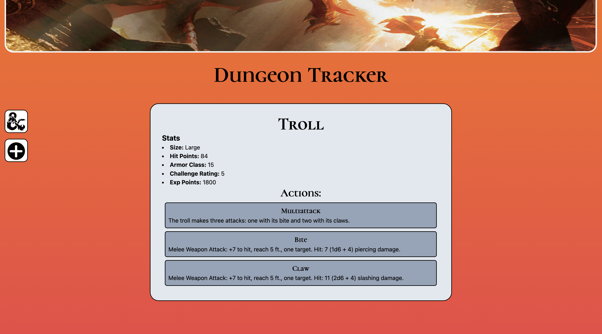

# Dungeon Tracker

Dungeon Tracker is a Dungeons & Dragons campaign management application! With Dungeon tracker you can easily and seamlessly create tabletop role playing game campaigns, add battle encounters to them, and pull monster information from the DnD5e API! Gone are the days of manually looking up monster data for your Dungeons & Dragns campaigns. Simply go to the encounter that you would like to add a monster to, type in its name, click "Add", and see the data appear before your eyes!

---

## Screenshots 

### Home Page

### Encounter Details Page

### Monster Details Page

---

## Technologies Used

- MongoDB
- Express.js
- React
- Node.js
- Tailwind CSS
- [DnD5e API](https://www.dnd5eapi.co/docs/#overview)

---

## Getting Started

[Deployed Application](https://dungeon-tracker.netlify.app/)

[Trello Board for Project Planning](https://trello.com/b/EVcmF2hq)

---

## Next Steps/Planned Future Enchancements

 - Ability to update encounter details
 - Ability to delete encounters
 - User authentication and authorization
 - Ability to remove monsters from encounters
 - Catalog page of all monsters in the DnD5e API
 - Player character creation feature